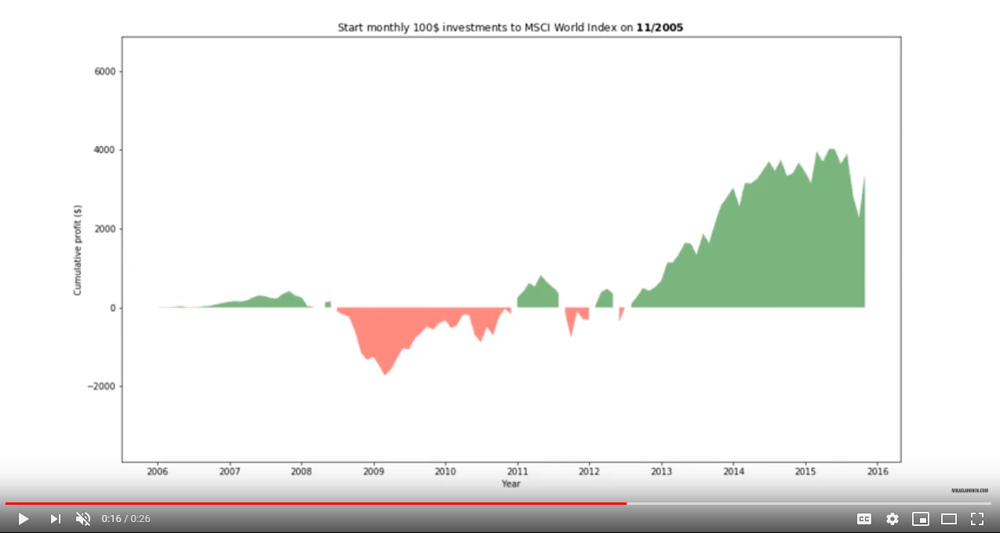

# Economical Cycle Timing
If you invest monthly to index based world wide ETF, does it matter what is the stage of economical cycle when you start?

Check out the `economical-cycle-timing.ipynb` for the data analysis.

## Related blog post
Here is [the original blog in Finnish](https://mikaelahonen.com/fi/blog/kannattaako-saannollinen-sijoittaminen-aloittaa-laskusuhdanteen-lahestyessa-data-analyysi/).

## Summary of results
Here is a summary of results in video. It shows 10 year cumulative profits by different starting year for a monthly investor.

Click the image to view on Youtube (0 min 26 sec).

## Data
The `msci-world-index-historical-data-1969-2018.xlsx` file contains the investment data.

The data is from [here](https://app2.msci.com/products/indexes/performance/regional_chart.html?asOf=Dec%2007,%202018&size=36&scope=R&style=C&currency=15&priceLevel=0&indexId=106#). Remember to allow Flash.

## Development environment
I used Ubuntu subsystem for Windows for development.

The `env_example.sh` contains a template script that you can paste to Ubuntu editor when starting a development session.

Python 3.6 has been used. In Ubuntu 18 python 3.6 should be pre-installed. Try it with command `python3 -V`.

Install virtual environment by `pip3 install virtualenv`. Create a new virtualenv by `virtualenv venv`.
